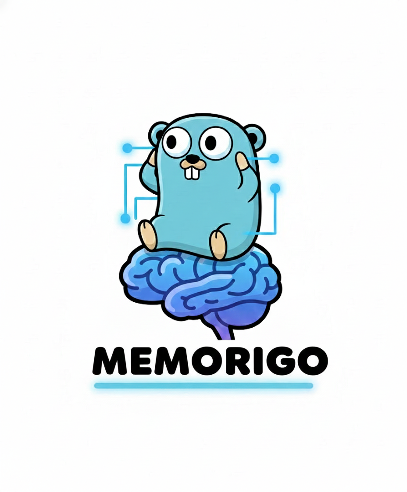

<p align="center">
  
</p>

**memorigo** 是对 Python 版 [Memori](企业 AI 记忆层) 的 Go 语言复现与扩展，目标是在 Go 生态中提供一套：

- **LLM 无关**：目前仅支持 OpenAI 与硅基流动（OpenAI-compatible），后续可扩展其它模型
- **存储无关**：统一封装 SQLite / PostgreSQL / MongoDB 的 schema 与读写逻辑
- **自动记忆**：在不侵入业务代码的前提下，自动持久化 LLM 对话，并支持语义 Recall
- **离线增强**：完全离线的事实抽取 + 摘要增强，不依赖 Memori 云 API

整体设计严格对齐原 Python 项目的架构（Core / Storage / Memory / Augmentation），但用 Go 的静态类型与接口重写了一套更贴合 Go 开发习惯的 SDK。

---

### 核心能力

- **Memori 核心对象**
    - `memori.New(...)` 创建实例
    - `Attribution(entityID, processID)` 设置归因（用户、进程/Agent）
    - `NewSession()/SetSession()` 控制会话
    - `Recall(query, limit)` 语义召回事实

- **多存储支持**
    - SQLite：用于本地开发 / 内存测试
    - PostgreSQL：生产数据库
    - MongoDB：文档型存储
    - 通过 `WithStorageConn(conn)` 传入 `*sql.DB` 或 `*mongo.Database`，内部自动选择 adapter/driver 并执行 migrations

- **OpenAI / 硅基流动 一体化接入**
    - `NewOpenAIClient()` / `NewSiliconFlowClient()` 创建 OpenAI-compatible client
    - `mem.OpenAI.Register(client)` 一行完成绑定
    - 使用 `mem.OpenAIClient().ChatCompletionsCreate/Stream` 调用 LLM 时，会自动：
        - 记录请求 messages 与模型回复
        - 更新/创建 `entity/process/session/conversation/message`
        - 触发离线增强，写入 `entity_fact` 与会话摘要

- **语义嵌入与增强（Advanced Augmentation）**
    - 支持多种嵌入提供商：OpenAI (`text-embedding-ada-002`)、硅基流动、Hash（离线fallback）
    - 后台 goroutine pool，从对话中抽取简单事实（当前按整句/规则抽取）
    - 生成语义嵌入向量，支持精确的语义相似度计算
    - Upsert 到 `memori_entity_fact`（带出现次数与最近时间）
    - 更新 `memori_conversation.summary` 简要摘要
    - 与 Recall 的向量相似度检索打通

---

### 目录结构简要

- `memori/`
    - `memori.go`：`Memori` 主入口（配置、存储、增强、OpenAI provider）
    - `config.go`：`Config/Cache`，统一 Session/LLM/Storage 配置
    - `writer.go`：将对话写入存储，并触发增强（事务 + 重试）
    - `recall.go`：`Recall.SearchFacts` 实现语义召回
    - `augmentation.go`：离线增强 manager（异步队列 + facts/summary 抽取）
    - `openai_compat.go`：OpenAI-compatible HTTP client
    - `openai_memori_client.go`：包装器，自动把 LLM 调用持久化并增强
- `storage/`
    - `manager.go` / `registry.go`：adapter/driver 注册与选择
    - `adapter_sql.go` / `adapter_mongo.go`：`*sql.DB` / `*mongo.Database` 适配
    - `driver_sql.go` / `driver_mongo.go`：dialect 识别与 migrations
    - `migrations_*.go`：SQLite/Postgres/Mongo 的建表/索引迁移
    - `repos.go`：Entity/Process/Session/Conversation/Message/EntityFact repo 实现（含 embedding 相似度计算）

---

### 快速开始（SQLite 内存库）

```bash
cd memorigo
go run ./examples/sqlite
```

这个示例会：

1. 使用内存 SQLite 执行 schema migrations
2. 写入一段对话 `"My favorite color is blue"`
3. 离线增强自动把这句话变成 fact 写入 `entity_fact`
4. `Recall("favorite color", 5)` 会返回按相似度排序的事实列表

---

### OpenAI 一体化示例

确保已设置：

```bash
set OPENAI_API_KEY=your_openai_key
```

然后运行：

```bash
cd memorigo
go run ./examples/openai
```

示例逻辑：

1. 通过 `NewOpenAIClient()` 创建 OpenAI client，并 `mem.OpenAI.Register(client)`
2. 用 `mem.OpenAIClient().ChatCompletionsCreate(...)` 调用 `gpt-4o-mini`
3. 调用结束后自动写入对话 + 触发增强
4. 使用 `mem.Recall("favorite programming language", 5)` 召回对应事实

---

### 硅基流动一体化示例

确保已设置：

```bash
set SILICONFLOW_API_KEY=your_siliconflow_key
set SILICONFLOW_BASE_URL=https://api.siliconflow.cn   # 可选，默认即为此
```

运行：

```bash
cd memorigo
go run ./examples/siliconflow
```

示例会使用你配置的硅基流动模型（例如 `Pro/Qwen/Qwen2.5-VL-7B-Instruct`），同样自动完成对话写入与增强，并通过 `Recall("favorite city", 5)` 做召回。

---

### 嵌入配置

Memori 支持多种嵌入提供商来生成语义向量：

```bash
# 嵌入提供商 (默认: hash)
export MEMORI_EMBEDDING_PROVIDER="openai"  # 或 "siliconflow", "hash"

# OpenAI 嵌入配置
export MEMORI_EMBEDDING_API_KEY="your-openai-api-key"
export MEMORI_EMBEDDING_BASE_URL="https://api.openai.com"  # 可选

# 硅基流动嵌入配置
export MEMORI_EMBEDDING_API_KEY="your-siliconflow-api-key"
export MEMORI_EMBEDDING_BASE_URL="https://api.siliconflow.cn"  # 可选

# 自定义模型和维度 (可选)
export MEMORI_EMBEDDING_MODEL="text-embedding-ada-002"
```

#### 嵌入提供商对比

| 提供商 | 特点 | 适用场景 |
|--------|------|----------|
| **OpenAI** | 高质量语义理解，1536维 | 生产环境，精确检索 |
| **硅基流动** | 中文优化，1024维 | 中文应用，成本敏感 |
| **Hash** | 完全离线，64维 | 开发测试，无API依赖 |

#### 测试嵌入功能

运行嵌入示例来测试不同提供商：

```bash
cd memorigo

# 测试所有嵌入提供商
go run ./examples/embedding

# 或只测试 Hash 嵌入 (默认)
export MEMORI_EMBEDDING_PROVIDER="hash"
go run ./examples/embedding
```
